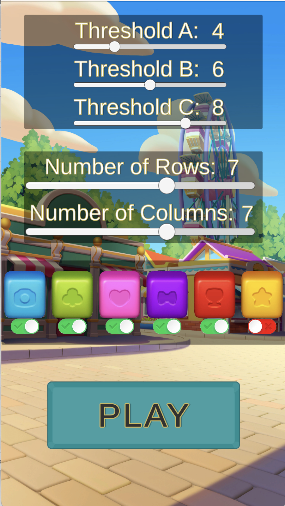
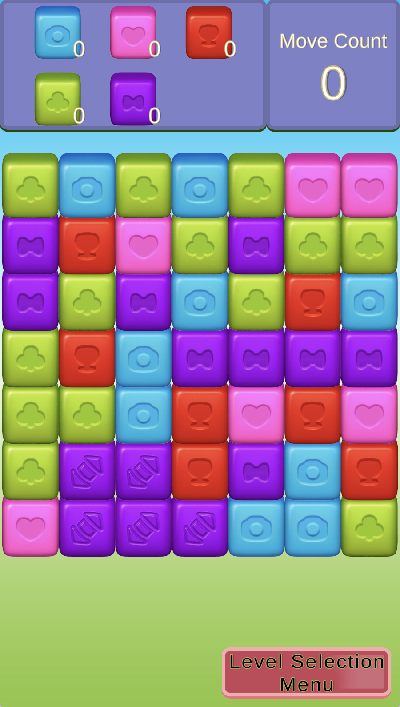
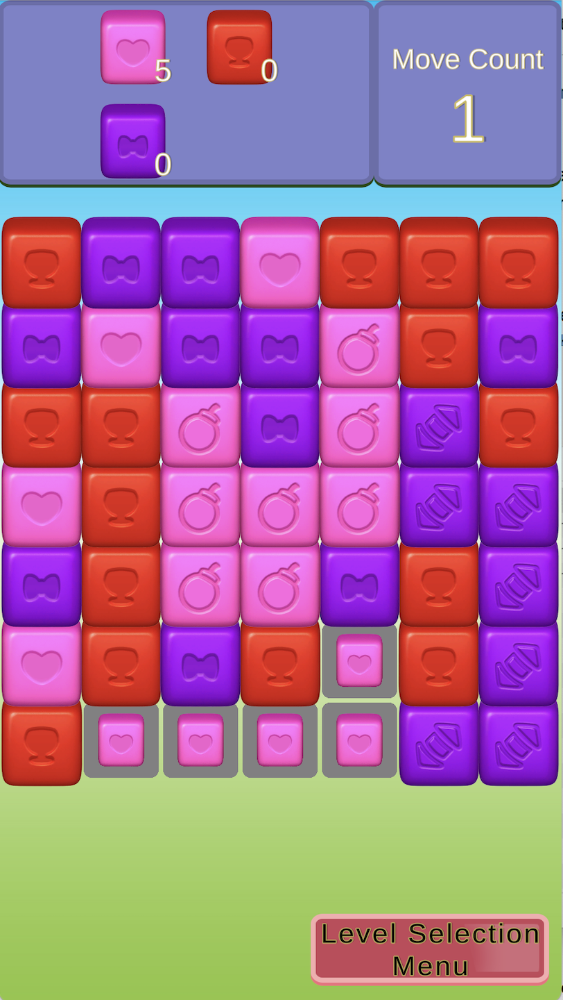

## Game Mechanics

The Collapse/Blast mechanic is a gameplay feature commonly found in tile-matching games. In these types of games, players are tasked with identifying clusters of blocks of the same color, and by tapping or clicking on these clusters, they eliminate the corresponding blocks from the game board. Subsequently, the empty spaces are refilled with the blocks stacked above them, and new blocks are generated to maintain the gameplay.

## Game Screenshots

**Level Scene**

**Game Scene**

**Click and Blast Animation**

**Game Overview:**

Our game consists of two scenes: **GameScene** and **LevelSelectionScene**. The game is initiated from the **LevelSelectionScene**. 

**Grid Creation Rules:**

1. For grid creation, we follow these rules:
   - Threshold C should be greater than Threshold B, and Threshold B should be greater than Threshold A.
   - The number of rows in the grid must be greater than or equal to the number of columns.
   - At least two colors must be selected.

**Icon Displays**

We aim to make gameplay easier for players when identifying larger groups of blocks. To achieve this, we have implemented a system of different icons on blocks based on the size of the corresponding groups. Here are the rules:

Initially, all blocks in a group display default icons.

If a group contains more blocks than the threshold A, it will display the first icon.
If a group contains  more blocks than the threshold B, it will display the second icon.
If a group contains  more blocks than the threshold C, it will display the third icon.

This system ensures that players can quickly identify the size of the block groups, improving their gaming experience.

**Gameplay Interaction:**

During gameplay, touch or click input is temporarily disabled when animations are in progress or when the board is being refilled. This ensures that players don't interfere with the collapsing and refilling processes.

**Script Organization:**

We've organized our scripts into two categories:
1. **Game Scripts**
2. **Level Selection Scripts**

Additionally, we use a static class to manage data for loading the Game Scene. This static class is reset each time players return to the Level Selection Scene.
